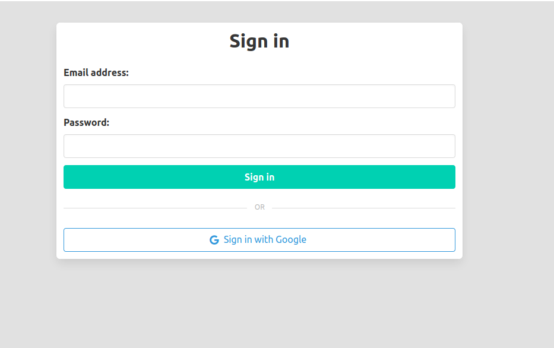

Bulma Widget
============

Bulma widget is a django package that intergrates the Bulma css framework with django forms.


Dependencies
--------------
* Bulma css Framework 0.8.0+

* Django 2.2+


Quick Start
------------

1. Add *bulma_widget* to INSTALLED_APPS

2. Modify the field in your forms by adding the bulma widgets, an example:
   
   ```
   from bulma_widget import widgets
   
   class User(forms.ModelForm):
	   username = forms.Charfield(max_length=10, widget=widgets.BulmaTextInput)
	   password = forms.CharField(widget=widgets.BulmaPasswordInput)
   ```


3. Include the *bulma_widget/form.djhtml* into your templates when you need to render a form.
   
   ```
   
   ```


Screenshot
-----------

